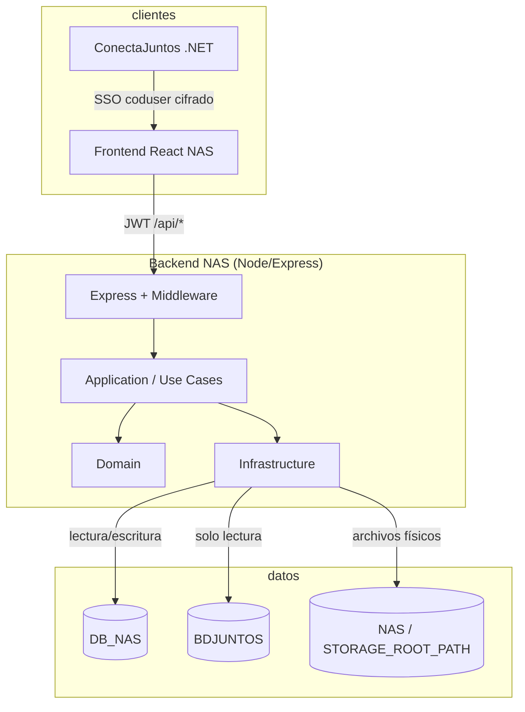
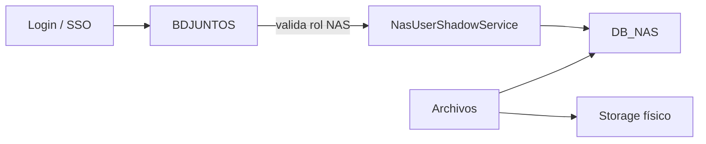

# Documento de arquitectura — Backend NAS

Módulo de almacenamiento institucional (**NAS**) del ecosistema ConectaJuntos. API REST en Node.js que gestiona archivos, carpetas, permisos y usuarios sombra, integrándose con la base corporativa **BDJUNTOS** para identidad y roles.

---

## 1. Vista general



| Aspecto | Decisión |
|---------|----------|
| Estilo arquitectónico | Hexagonal / DDD ligero |
| Runtime | Node.js 20+, TypeScript ESM |
| HTTP | Express 4 |
| Persistencia | SQL Server (dos bases) |
| Archivos | Sistema de archivos local o share NAS mapeado |

---

## 2. Capas del código

```
src/
├── domain/              Entidades y contratos (IUsuarioRepository, IArchivoRepository…)
├── application/         Casos de uso y servicios de dominio
│   ├── use-cases/       auth, files, folders, links, users, roles…
│   └── services/        IntranetPermissionService, NasUserShadowService…
├── infrastructure/      Adaptadores externos
│   ├── http/express/    Rutas, middleware, app.ts
│   ├── database/        connection.ts, repositories/, migrations/
│   ├── security/        JWT, Sicontigo, SSO crypto
│   ├── storage/         LocalStorageService, TemporaryStorageService
│   └── jobs/            Limpieza temporal, expiración vigencia
└── shared/              Errores, constantes NAS, utilidades
```

### Regla de dependencia

- `domain` no importa de `infrastructure`.
- `application` depende de `domain` (interfaces) y recibe implementaciones por composición en rutas/servicios.
- `infrastructure` implementa repositorios y expone HTTP.

---

## 3. Bases de datos

### DB_NAS (lectura/escritura)

- Usuarios **sombra** del módulo NAS.
- Archivos, carpetas, enlaces, auditoría, categorías locales.
- Pool: `getNasPool()` / `query()` — variables `MSSQL_NAS_*`.

### BDJUNTOS (solo lectura)

- Identidad Intranet: `INTRANET.tbl_mst_usuarios`.
- Roles NAS: `INTRANET.tbl_ctrl_usuario_role` (COD **1072–1080**).
- Credenciales legacy: `VIATICO.tbl_mst_usuario.vClave` (Sicontigo).
- Pool: `getUserPool()` / `queryUserDb()` — variables `MSSQL_USER_*`.
- Activación: `MSSQL_USERDATABASE` definido → `useIntranetUserDatabase() === true`.



---

## 4. Autenticación y autorización

### Modos de entrada

| Modo | Entrada | Validación |
|------|---------|------------|
| Login manual | `POST /api/auth/login` `{ documento, password }` | BDJUNTOS + `vClave` Sicontigo o usuario local DB_NAS |
| SSO ConectaJuntos | `POST /api/auth/sync-external-user` | `dniEncrypted` + header `X-NAS-SSO-Flag` |
| Refresh | `POST /api/auth/refresh` | Refresh token → revalida BDJUNTOS |

### JWT

- Access token: `userId`, `email`, `rol`, `codUsuario` (Intranet), `useIntranet`.
- Middleware `auth.middleware.ts`: en modo Intranet **revalida** usuario activo y roles NAS en cada petición.

### Roles NAS

| COD | Uso |
|-----|-----|
| 1072 | Admin NAS (único admin del módulo) |
| 1073–1080 | Roles operativos NAS / UTI |

Definidos en `src/shared/constants/nasRoles.ts`.

### Permisos

- Matriz rol × categoría × acción.
- Middleware `requirePermiso.middleware.ts` en rutas `/api/admin` y operaciones sensibles.

---

## 5. Módulos funcionales

| Módulo | Use cases principales | Rutas |
|--------|----------------------|-------|
| Auth | Login, Refresh, SyncExternalUser | `/api/auth` |
| Archivos | List, Upload, Download, Move, Vigencia | `/api/files` |
| Carpetas | CRUD, share, upload-policy | `/api/folders` |
| Enlaces | Crear/revocar enlaces públicos | `/api/links`, `/v/:token` |
| Admin | Usuarios, roles, categorías, auditoría | `/api/admin` |

---

## 6. Almacenamiento de archivos

- Ruta raíz: `STORAGE_ROOT_PATH` (share NAS o disco local).
- Modo temporal opcional: `USE_TEMP_STORAGE` + job de limpieza.
- Metadatos en DB_NAS; binarios en filesystem.
- Categorías NAS derivadas de rutas físicas configuradas.

---

## 7. Seguridad

| Componente | Archivo | Función |
|------------|---------|---------|
| JWT | `JwtService.ts` | Tokens access/refresh |
| Bcrypt | `PasswordService.ts` | Usuarios locales DB_NAS |
| Sicontigo | `sicontigoCrypto.ts` | Login Intranet (`SICONTIGO_*` en `.env`) |
| SSO NAS | `nasSsoCrypto.ts` | Descifrado DNI (`NAS_SSO_*` en `.env`) |
| HTTP | helmet, cors | Cabeceras y orígenes permitidos |

**Principio:** secretos solo en variables de entorno; sin valores por defecto en código para `SICONTIGO_*` ni exposición del flag SSO en respuestas JSON.

---

## 8. Integración con ConectaJuntos

El backend **no** llama al portal .NET. El flujo SSO es:

1. Frontend obtiene `coduser` cifrado de ConectaJuntos.
2. Frontend llama `POST /api/auth/sync-external-user`.
3. Backend descifra DNI, consulta BDJUNTOS y emite JWT.

Contrato del portal: ver `microservicio/docs/INTEGRACION-CONECTAJUNTOS-NET.md`.

---

## 9. Despliegue y operación

- Entry: `src/main.ts` — migraciones, jobs, listen.
- Health: `GET /health`.
- Documentación operativa: [manual-despliegue.md](./manual-despliegue.md).
- Variables: `env.template` y sección correspondiente en `.env`.

---

## 10. Documentos relacionados

| Documento | Contenido |
|-----------|-----------|
| [manual-tecnico.md](./manual-tecnico.md) | APIs, repositorios, flujos detallados |
| [manual-del-sistema.md](./manual-del-sistema.md) | Manual funcional y permisos |
| [manual-despliegue.md](./manual-despliegue.md) | Instalación y producción |
| [versionamiento.md](./versionamiento.md) | Releases y migraciones |
