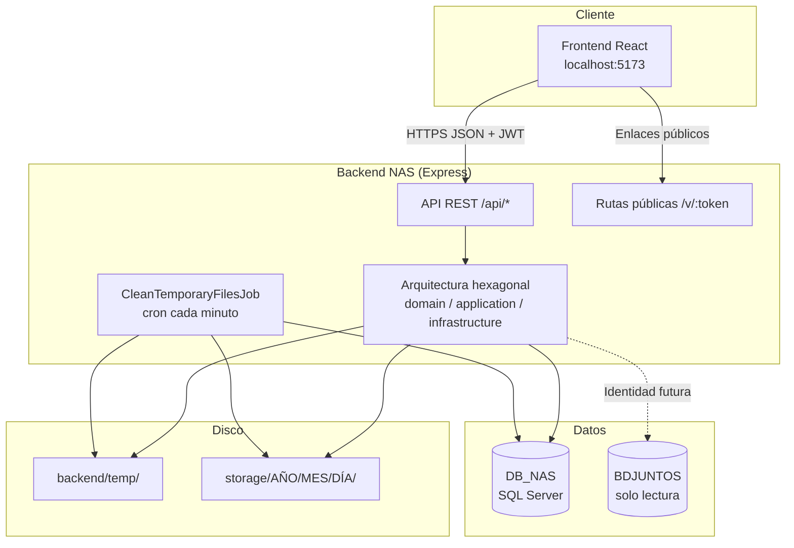
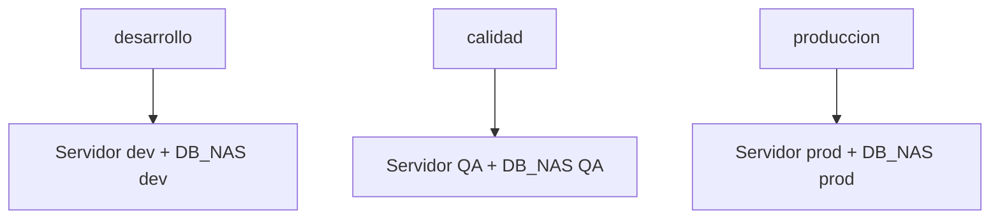

# 02 — Composición y arquitectura

## 1. Vista general

El sistema se compone de cuatro capas principales:

1. **Frontend web** (React + Vite) — interfaz de usuario.
2. **Backend API** (Node.js + Express) — lógica de negocio y orquestación.
3. **SQL Server** — metadatos, permisos y trazabilidad.
4. **Almacenamiento en disco** — archivos físicos (temporal + permanente).



---

## 2. Arquitectura hexagonal del backend

```
backend/src/
├── domain/           # Entidades y contratos (puertos)
│   ├── entities/
│   └── repositories/ # Interfaces I*Repository
├── application/      # Casos de uso (reglas de negocio)
│   └── use-cases/
├── infrastructure/   # Adaptadores
│   ├── database/sqlserver/repositories/
│   ├── http/express/routes/
│   ├── storage/local/
│   ├── security/
│   └── jobs/
└── shared/             # Errores, tipos, constantes
```

**Principio:** la lógica de negocio no depende de Express ni de `mssql`; los repositorios implementan los puertos del dominio.

---

## 3. Frontend web

| Aspecto | Detalle |
|---------|---------|
| Framework | React 18 + TypeScript |
| Build | Vite 5 |
| Estilos | Tailwind CSS (paleta *Stormy morning*) |
| Routing | React Router (`/login`, `/`, `/admin`, `/v/:token`) |
| HTTP | Axios con interceptores JWT |
| Upload | React Dropzone |

**Pantallas principales:** Login, Dashboard (archivos/carpetas), Admin (usuarios/roles), Vista pública de enlace.

---

## 4. Backend API

| Aspecto | Detalle |
|---------|---------|
| Runtime | Node.js 20+ |
| Framework | Express 4 |
| Auth | JWT + refresh token |
| Upload | Multer (memory storage) |
| Seguridad HTTP | Helmet, CORS configurable |
| Jobs | node-cron (promoción de archivos temporales) |
| Logs | Winston / console |

**Prefijos de ruta:**

| Prefijo | Autenticación | Función |
|---------|---------------|---------|
| `/api/auth` | No (login) | Autenticación |
| `/api/files` | JWT | Archivos |
| `/api/folders` | JWT | Carpetas |
| `/api/links` | JWT | Enlaces |
| `/api/admin` | JWT | Administración |
| `/v/:token` | No | Descarga/vista pública |
| `/health` | No | Health check |

---

## 5. Bases de datos

### DB_NAS (lectura/escritura)

Contiene tablas con prefijo `NASTM_` (maestras) y `NASTD_` (detalle / relaciones):

- Usuarios, roles, permisos, categorías
- Archivos, carpetas, enlaces
- Carpetas compartidas, usuario-categoría

### BDJUNTOS (solo lectura — configuración en `.env`)

Conexión preparada para consultar identidad y roles de **ConectaJuntos** sin duplicar usuarios maestros. Variables: `MSSQL_USER_*`.

---

## 6. Almacenamiento en disco


| Ruta | Variable `.env` | Propósito |
|------|-----------------|-----------|
| `./temp` | `TEMP_STORAGE_PATH` | Staging inmediato post-upload |
| `../storage` | `STORAGE_ROOT_PATH` | Almacenamiento definitivo por fecha |

Los nombres físicos se generan de forma opaca (hash) para no exponer nombres originales en disco.

---

## 7. Integraciones

| Sistema | Tipo | Estado |
|---------|------|--------|
| ConectaJuntos / BDJUNTOS | SQL Server lectura | Configurado en `.env` |
| Microservicio ConectaJuntos | REST (simulador local) | Referencia en `microservicio_conectajuntos/` |
| Cloudflare Tunnel / ngrok | Túnel dev | CORS automático en backend |
| GitLab Juntos | CI/CD / repos | `srvgit.juntos.gob.pe/conectajuntos/nasback` |

---

## 8. Despliegue por ambiente



Cada ambiente mantiene su propio `.env` (servidor SQL, JWT, rutas de storage y CORS).

---

## 9. Seguridad en capas

1. **Transporte:** HTTPS en producción.
2. **Autenticación:** JWT en header `Authorization: Bearer`.
3. **Autorización:** roles + permisos en BD + reglas de categoría/privacidad.
4. **Archivos:** validación de tamaño; nombres físicos no predecibles.
5. **Enlaces:** tokens de 64 caracteres; expiración y revocación.
6. **HTTP:** Helmet + CORS restringido (excepto túneles dev configurados).
