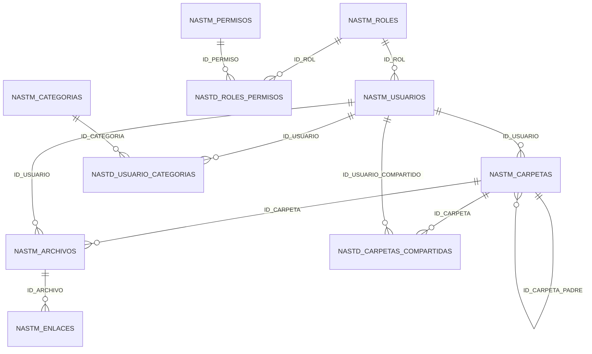

# 03 — Modelo de datos

## 1. Motor y convenciones

| Aspecto | Valor |
|---------|-------|
| Motor | Microsoft SQL Server |
| Base principal | `DB_NAS` |
| Prefijo maestro | `NASTM_` |
| Prefijo detalle | `NASTD_` |
| PK | `UNIQUEIDENTIFIER` (`ID_*`) |
| Baja lógica | `FE_BAJA` / `ES_VIGENTE` |
| Fechas | `FE_CREACION`, `FE_ACTUALIZACION`, etc. |

> Los scripts en `../scripts/` usan nomenclatura PostgreSQL histórica; el modelo operativo en producción es **SQL Server** con prefijos `NAST*`.

---

## 2. Tablas principales

### Maestras (`NASTM_`)

| Tabla | Descripción |
|-------|-------------|
| `NASTM_USUARIOS` | Usuarios del NAS (correo, hash, límites, privacidad) |
| `NASTM_ROLES` | Roles del sistema (USER, ADMIN, …) |
| `NASTM_PERMISOS` | Catálogo de permisos (`file.upload`, `admin.manage_users`, …) |
| `NASTM_CATEGORIAS` | Categorías organizacionales (UOP, áreas) |
| `NASTM_CARPETAS` | Jerarquía de carpetas por usuario |
| `NASTM_ARCHIVOS` | Metadatos de archivos subidos |
| `NASTM_ENLACES` | Tokens de acceso público/temporal |

### Detalle / relaciones (`NASTD_`)

| Tabla | Descripción |
|-------|-------------|
| `NASTD_ROLES_PERMISOS` | Rol ↔ permiso (N:M) |
| `NASTD_USUARIO_CATEGORIAS` | Usuario ↔ categoría (visibilidad) |
| `NASTD_CARPETAS_COMPARTIDAS` | Carpeta ↔ usuario invitado + nivel (READ/WRITE/ADMIN) |

---

## 3. Campos clave por entidad

### NASTM_USUARIOS

| Columna | Tipo lógico | Descripción |
|---------|-------------|-------------|
| `ID_USUARIO` | UUID | Identificador |
| `NO_COMPLETO` | string | Nombre completo |
| `DI_CORREO` | string | Email (login) |
| `CO_PASSWORD_HASH` | string | Hash bcrypt |
| `ID_ROL` | UUID FK | Rol asignado |
| `ES_VIGENTE` | bit | Usuario activo |
| `IN_ES_PRIVADO` | bit | No comparte por categoría |
| `CA_LIMITE_ALMACENAMIENTO_BYTES` | bigint | Cuota total |
| `CA_MAX_ARCHIVO_BYTES` | bigint | Tamaño máx. por archivo |
| `FE_ULTIMO_LOGIN` | datetime | Último acceso |

### NASTM_ARCHIVOS

| Columna | Descripción |
|---------|-------------|
| `NO_ARCHIVO_ORIGINAL` | Nombre visible al usuario |
| `NO_ARCHIVO_FISICO` | Nombre en disco (opaco) |
| `DE_RUTA_FISICA` | Ruta relativa `AÑO/MES/DÍA` |
| `TI_MIME` | Tipo MIME |
| `CA_TAMANO_BYTES` | Peso en bytes |
| `CO_HASH_SHA256` | Hash integridad / deduplicación |
| `IN_EN_TEMPORAL` | Si aún está en `temp/` |
| `DE_RUTA_TEMPORAL` | Ruta staging |
| `FE_BAJA` | Soft delete |

### NASTM_ENLACES

| Columna | Descripción |
|---------|-------------|
| `CO_TOKEN` | Token público único |
| `IN_ES_TEMPORAL` | Enlace con expiración |
| `FE_EXPIRACION` | Fecha límite |
| `CA_MAX_VISITAS` | Tope de accesos |
| `CA_VISITAS_ACTUALES` | Contador |
| `ES_VIGENTE` | Activo / revocado |
| `ID_ARCHIVO` | Archivo asociado |

---

## 4. Diagrama entidad-relación (simplificado)

---

## 5. Reglas de negocio en datos

1. **Visibilidad por categoría:** dos usuarios ven carpetas/archivos del otro si comparten al menos una categoría en `NASTD_USUARIO_CATEGORIAS`, salvo `IN_ES_PRIVADO = 1`.
2. **ADMIN:** al sincronizar categorías, el administrador recibe todas las categorías existentes.
3. **Soft delete:** `FE_BAJA IS NULL` en consultas activas; no se borra el binario de inmediato en todas las operaciones.
4. **Cuotas:** `SUM(CA_TAMANO_BYTES)` por usuario vs `CA_LIMITE_ALMACENAMIENTO_BYTES`.
5. **Enlaces expirados:** `FE_EXPIRACION < NOW()` o `CA_VISITAS_ACTUALES >= CA_MAX_VISITAS` → acceso denegado.

---

## 6. Permisos semilla (referencia)

| Código | Descripción |
|--------|-------------|
| `file.upload` | Subir archivos |
| `file.download` | Descargar |
| `file.delete` | Eliminar propios |
| `file.rename` / `file.move` | Renombrar / mover |
| `file.generate_link` | Crear enlaces |
| `folder.create` / `folder.share` | Carpetas |
| `admin.manage_users` | Gestión de usuarios |
| `admin.manage_roles` | Gestión de roles |
| `mod.*` | Acciones de moderación |

Ver script `../scripts/VERIFICAR_ROLES_PERMISOS.sql` para validar asignaciones.

---

## 7. Scripts de mantenimiento

| Script | Uso |
|--------|-----|
| `../scripts/database-clean.sql` | Recrear esquema y datos iniciales |
| `../scripts/database.sql` | Esquema base (referencia PostgreSQL) |
| `../scripts/VERIFICAR_ROLES_PERMISOS.sql` | Auditoría de roles y permisos |

---

## 8. Índices recomendados (operación)

- `NASTM_USUARIOS(DI_CORREO)` — login.
- `NASTM_ARCHIVOS(ID_USUARIO, FE_BAJA)` — listado por usuario.
- `NASTM_ARCHIVOS(IN_EN_TEMPORAL)` — job de promoción.
- `NASTM_ENLACES(CO_TOKEN)` — acceso público.
- `NASTD_USUARIO_CATEGORIAS(ID_USUARIO, ID_CATEGORIA)` — visibilidad cruzada.
