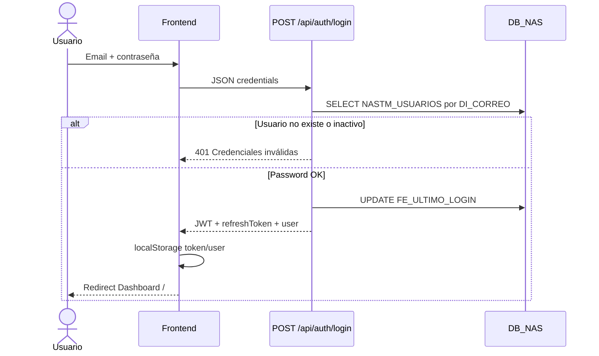
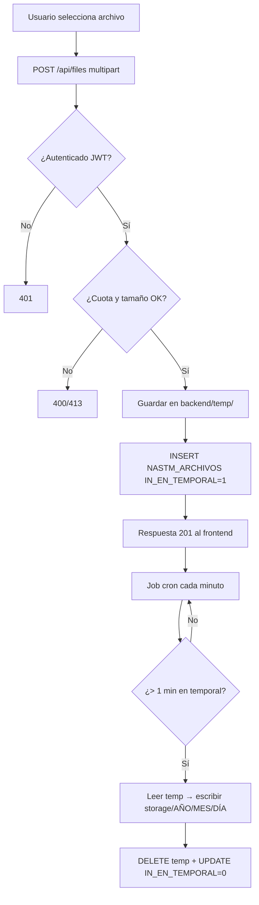
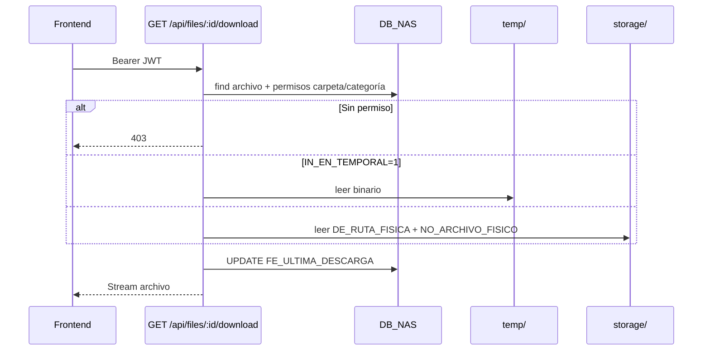
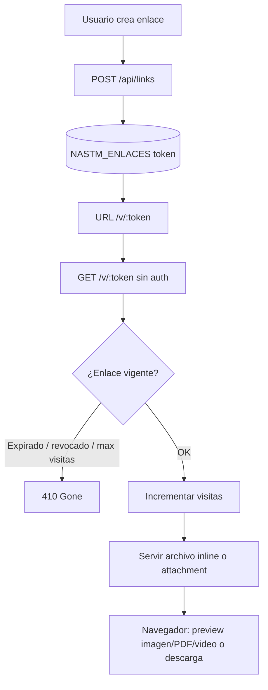
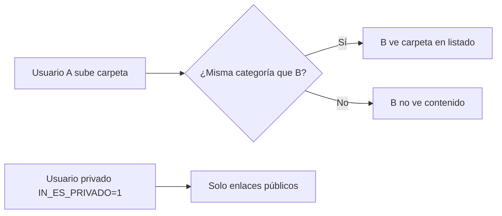
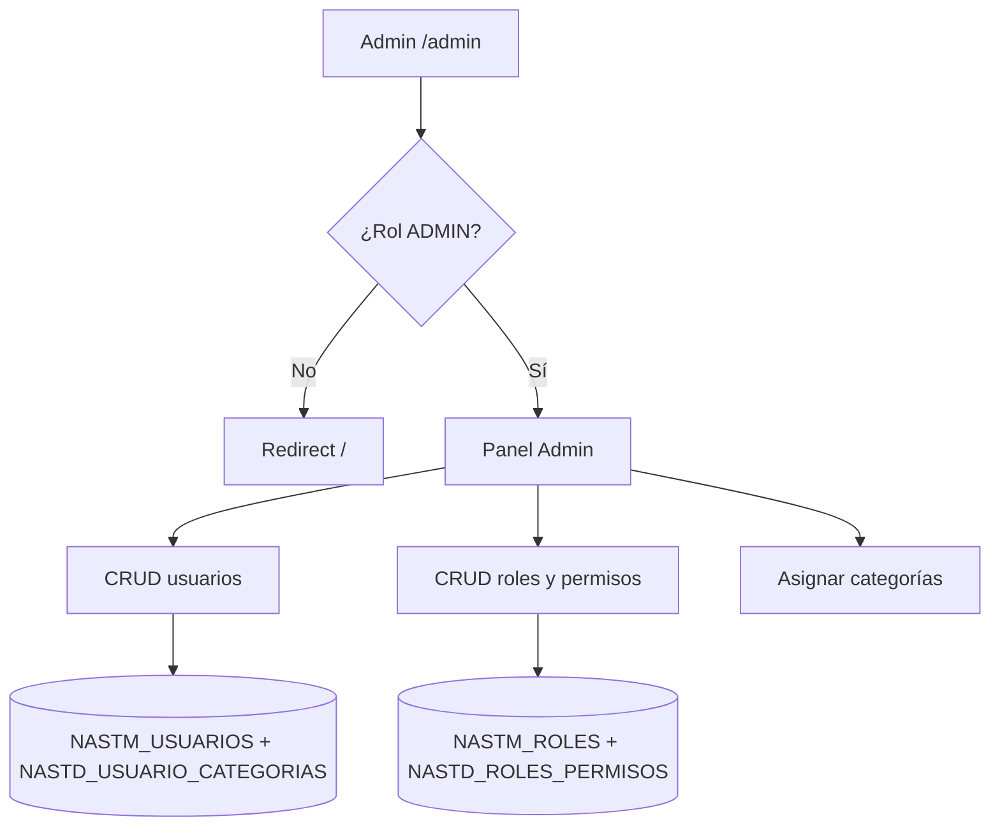
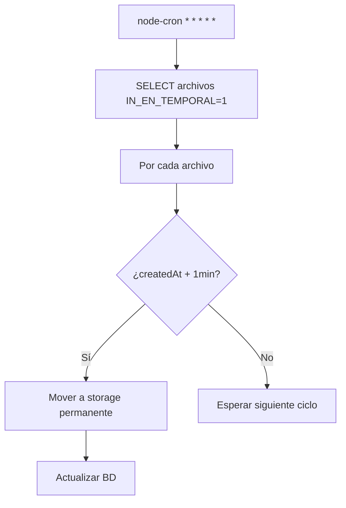
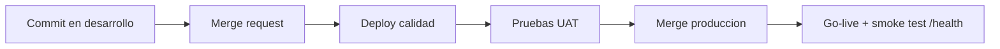
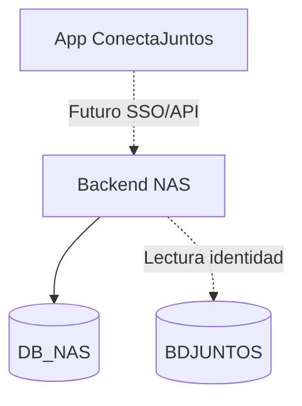

# 04 — Diagramas de flujo

## 1. Autenticación (login)

---

## 2. Subida de archivo (upload + promoción temporal)

---

## 3. Descarga autenticada

---

## 4. Enlace público / temporal

**Frontend:** ruta React `/v/:token` consume el mismo endpoint y renderiza preview según MIME.

---

## 5. Compartir carpeta por categoría

**Compartir explícito:** `ShareFolderUseCase` → `NASTD_CARPETAS_COMPARTIDAS` con permiso READ/WRITE/ADMIN.

---

## 6. Administración de usuarios y roles

---

## 7. Limpieza y mantenimiento automático

Variable relacionada: `TEMP_FILE_TTL_MINUTES` (default 1).

---

## 8. Flujo de despliegue por ambiente

---

## 9. Integración ConectaJuntos (visión)

Estado actual: credenciales NAS en `NASTM_USUARIOS`; conexión BDJUNTOS preparada en `.env` para evolución a SSO unificado.
